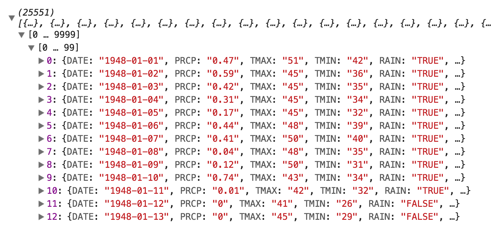
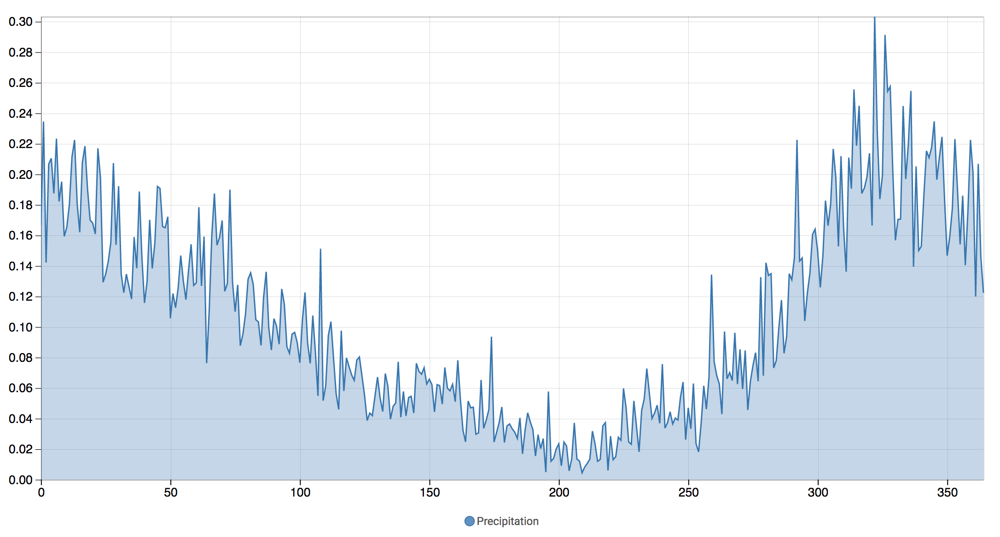
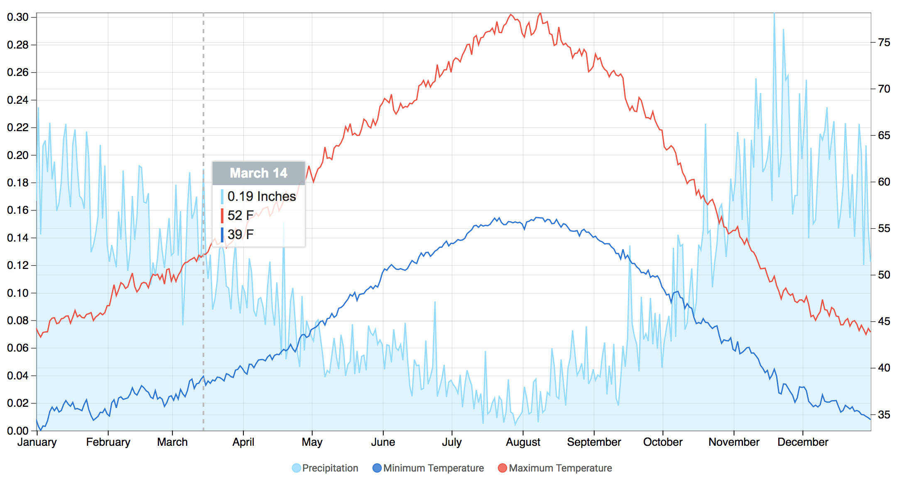
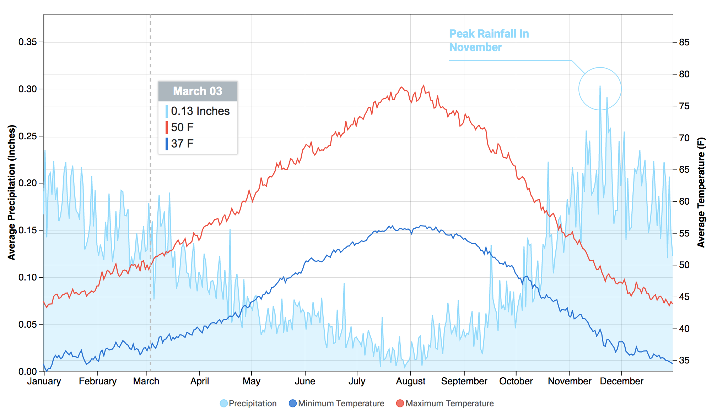
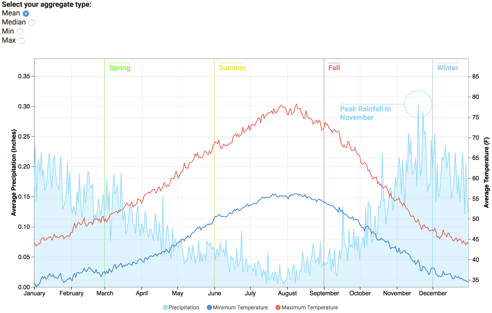

# D2B-Workshop

> build d2b examples with real data

## 1. Development Environment
To follow this tutorial, you will need the following tools:

- NodeJS and npm: [Download](https://nodejs.org/en/)
- Vue devtools extension for Chrome or Firefox (for the vue.js portion: not necessary, but recommended) [Firefox](https://addons.mozilla.org/en-US/firefox/addon/vue-js-devtools/) / [Chrome](https://chrome.google.com/webstore/detail/vuejs-devtools/nhdogjmejiglipccpnnnanhbledajbpd?hl=en)
- A text editor

## 2. Download The Workshop Project
To get started with this workshop there is a project template already setup. To download the template run the following command:
```bash
$ git clone https://github.com/d2bjs/d2b-workshop.git
```

Then proceed into the directory:
```bash
$ cd d2b-workshop
```

It is not recommended to use this project in production as is. It is only setup with a development webpack environment.  

### File Structure
Most of the workshop code will go into the `src` directory. This directory contains the following folders:

- `data`: containing some sample data sets
- `demo_d2b`: containing index.js and index.html to be used for creating the d2b demo
- `demo_vue_d2b`: containing index.js and index.html to be used for creating the d2b with vue demo
- `index`: containing index.js, index.html, and styles.scss. The index.html file will be used to list links to the demo pages. The index.js and styles.scss files will also be compiled into the demo pages for shared scripts or styles.

### Running The Dev-server
We can take a look at the application that has been generated by starting the webpack-dev-server using the following command:
``` bash
$ npm start
```

This will start a local server on port 8080, so we can take a look at our application at http://localhost:8080. As we develop our application, webpack will detect any changes we make and will automatically reload our webpage for us.

To stop the server simply use `ctrl-c`

### Pre-installed Dependencies
The project template should already have the dependencies listed that you will need for this workshop. You can install them by running:

Our application has almost everything we will need, but there are a couple packages that will need to be installed. To do this will need to declare them in the `package.json` file, so go ahead and open that up and add the following within the `dependencies` object.
``` bash
$ npm install
```

## 3. D2B example: src/demo_d2b
Lets build a demo with just d2b and d3:

### 3.1 Add a Chart Container: index.html
First, we will need to add a <div> container for our chart.

```html
...
<body>

  <h1>Demo D2B</h1>
  <div class="chart"></div>

</body>
...
```

### 3.2 Importing library modules: index.js
For this example we will need several modules from `d3` and `d2b` let's import those at the top of our index.js file. If you would like to know more about these modules check out the [d3](https://github.com/d3/d3/blob/master/API.md) and [d2b](docs.d2bjs.org) documentation.

```javascript
import { select, csv, scaleTime, extent, nest, mean, format, axisBottom, timeFormat } from 'd3'
import { chartAxis, svgLine, svgArea } from 'd2b'
```

### 3.3 Retrieve Some Data: index.js
Next, let's retrieve some data. For this example we will be working 25,000+ consecutive days of Seattle weather data. Once the data is fetched we can also add a new `date` property that is the weather date in `mm-dd` format (e.g. we will create a date without the year).

```javascript
...
csv('src/data/seattle_weather.csv', data => {
  data.forEach(d => d.date = d.DATE.slice(-5))
  console.log(data)
})
```

Now take a look at the data that has been printed to your console.



### 3.4 Format The Data: index.js
Instead of analyzing 25,000 days of data, let's average the data into 365 days.

Add a `getDailyData` function to the bottom of our script:

```javascript
...
function getDailyData (data) {
  // get daily mean precipitation and temperatures values
  return nest()
    .key(d => d.date)
    .entries(data.filter(d => d.date !== '02-29'))
    .map(d => {
      return {
        // the chart's x-axis will use javascript Dates, this requires a full date 'yyyy-mm-dd' so we will just use the current year and omit the year in the chart later on
        date: new Date(`2017-${d.key}`),

        // precipitation and temperature should be parsed as a float and then averaged
        precipitation: mean(d.values, v => parseFloat(v.PRCP)),
        tempMin: mean(d.values, v => parseFloat(v.TMIN)),
        tempMax: mean(d.values, v => parseFloat(v.TMAX))
      }
    })
}
```

What this script does is groups each row from our `data` by it's month and day `mm-dd`. Then average the different statistics that we have over all occurrences for each day.

Then we need to call this function after we retrieved our data in the previous step:

```javascript
...
csv('src/data/seattle_weather.csv', data => {
  data.forEach(d => d.date = d.DATE.slice(-5))
  console.log(data)

  const dailyData = getDailyData(data)
})

function getDailyData (data) {
  ...
}
```

### 3.5 Configure the d2b Axis Chart: index.js
In this step we will create a function to return the d2b.chartAxis generator. Later on we will configure the axis chart here as well.

```javascript
...
function getAxisChart () {
  return chartAxis()
}
```

And let's use that in our csv calback.

```javascript
...
csv('src/data/seattle_weather.csv', data => {
  data.forEach(d => d.date = d.DATE.slice(-5))
  console.log(data)

  const dailyData = getDailyData(data)

  const axisChart = getAxisChart()
})

...

function getAxisChart (data) {
  ...
}
```

### 3.6 Build the Axis Chart Data: index.js
Next, we will build the object that the axis chart is expecting. It should be formatted like this:

```javascript
{
  sets: [
    // the first set of graphs
    {
      // the generator for this set's graphs (e.g. svgBar, svgLine, svgArea, ..)
      generators: [...],
      // the graphs for this set
      graphs: [
        {
          // each graph should have a label and a set of values e.g. { x, y }
          label: '...',
          values: [...]
        },
        ...
      ]
    },
    ...
  ]
}
```

So that we keep the logic separated, let's create another function to build the axis chart data. We will pass it the daily weather data. For now we will just render the precipitation, and for the x value we will just use the date index. By using the svgArea and svgLine generators we will get a area chart with an emphasized line.

```javascript
...
function getChartData (data) {
  return {
    sets: [
      {
        generators: [svgArea(), svgLine()],
        graphs: [
          {
            label: 'Precipitation',
            values: data.map((d, i) => {
              return {
                x: i,
                y: d.precipitation
              }
            })
          }
        ]
      }
    ]
  }
}
```

### 3.7 Generate The Chart
We can now use the previously defined `getChartData` function to generate the chart. In order to generate the chart we must use d3 to select the container, set the chart datum, and apply the axisChart generator.

```javascript
...
csv('src/data/seattle_weather.csv', data => {
  data.forEach(d => d.date = d.DATE.slice(-5))
  console.log(data)

  const dailyData = getDailyData(data)

  const axisChart = getAxisChart()

  // select chart container and set datum
  const chart = select('.chart')
    .datum(getChartData(dailyData))
    .call(axisChart)
})
...
```

Voila! We have an axis chart with Seattle's average daily rainfall.



Now that we have a working chart, try playing around with different graph set generators to see how the chart changes (e.g. svgBar, svgScatter)

### 3.8 Configuring a Date X-Axis: index.js
Now let's do some customization. In order to use a javascript date time we must configure a couple of things:

First let's use the `date` attribute instead of the date index.

```javascript
...
{
  label: 'Precipitation',
  values: data.map(d => {
    return {
      x: d.date,
      y: d.precipitation
    }
  })
}
...
```

Next configure the x-axis on the axis chart. The x axis configuration callback function received the chart datum d, and a set of values as the arguments. The values can be used to dynamically define a scale domain (e.g. [min(values), max(values)]).

```javascript
...
function getAxisChart () {
  const monthFormat = timeFormat('%B')

  return chartAxis()
    .x((d, values) => {
      return {
        axis: axisBottom().tickFormat(monthFormat),
        scale: scaleTime().domain(extent(values))
      }
    })
}
...
```

### 3.9 Configuring Tooltip: index.js

Now we can make sure the tooltip is formatted how we want it.

We can configure the tooltip.title inside the axis chart configuration function. The tooltip title will receive the data rows to be referenced in the tooltip. We can simply print out the day formatted x-value of the first row.
```javascript
...
function getAxisChart () {
  const monthFormat = timeFormat('%B'),
        dayFormat = timeFormat('%B %d')

  return chartAxis()
    .x((d, values) => {
      return {
        axis: axisBottom().tickFormat(monthFormat),
        scale: scaleTime().domain(extent(values))
      }
    })
    .tooltipConfig(tooltip => {
      tooltip.title(rows => dayFormat(rows[0].x))
    })
}
...
```

The tooltip row can be configured in the same place. However, because the row configuration will change for precipitation and temperature graphs we can instead configure it in the graph data:

```javascript
...
function getChartData (data) {
  const numberFormat = format('.2'),
        tempFormat = d => `${numberFormat(d)} F`,
        precipFormat = d => `${numberFormat(d)} Inches`

  return {
    sets: [
      {
        generators: [svgArea(), svgLine()],
        graphs: [
          {
            label: 'Precipitation',
            tooltipConfig: tooltip => {
              tooltip.row(row => precipFormat(row.y))
            },
            values: data.map(d => {
              return {
                x: d.date,
                y: d.precipitation
              }
            })
          }
        ]
      }
    ]
  }
}
...
```

### 3.10 Specifying Graph Colors: index.js

By default d2b uses one of the d3 categorical color scales. We can override this by specifying a graphColor accessor when configuring the axis chart.
```javascript
...
function getAxisChart () {
  ...
    .tooltipConfig(tooltip => {
      tooltip.title(rows => dayFormat(rows[0].x))
    })
    .graphColor(d => d.color)
}
...
```

And then providing a color in the graph data:

```javascript
...
{
  label: 'Precipitation',
  color: '#7FDBFF',
  tooltipConfig: tooltip => {
    tooltip.row(row => precipFormat(row.y))
  },
  values: data.map(d => {
    return {
      x: d.date,
      y: d.precipitation
    }
  })
}
...
```

### 3.11 Responsive Chart: index.js
Let's quickly make the chart responsive. This can be done by listening to the window resize event and reapplying the axis chart generator to the selection.

```javascript
...
csv('src/data/seattle_weather.csv', data => {
  ...
  const chart = select('.chart')
    .datum(getChartData(dailyData))
    .call(axisChart)

  window.addEventListener('resize', function(){
    chart.call(axisChart)
  })
})
...
```

### 3.12 Adding Additional Graphs: index.js
For the temperature graphs we will use a separate graph set, and specify a different y-axis by setting `yType: 'y2'`.

```javascript
...
function getChartData (data) {
  const numberFormat = format('.2'),
        tempFormat = d => `${numberFormat(d)} F`,
        precipFormat = d => `${numberFormat(d)} Inches`

  return {
    sets: [
      ...
      {
        generators: [svgLine()],
        yType: 'y2',
        graphs: [
          {
            label: 'Minimum Temperature',
            yType: 'y2',
            color: '#0074D9',
            tooltipConfig: tooltip => {
              tooltip.row(row => tempFormat(row.y))
            },
            values: data.map(d => {
              return {
                x: d.date,
                y: d.tempMin
              }
            })
          },
          {
            label: 'Maximum Temperature',
            yType: 'y2',
            color: '#FF4136',
            tooltipConfig: tooltip => {
              tooltip.row(row => tempFormat(row.y))
            },
            values: data.map(d => {
              return {
                x: d.date,
                y: d.tempMax
              }
            })
          }
        ]
      }
    ]
  }
}
...
```

By now we should have something like this:



### 3.13 Configure Y-Axes: index.js
Let's add labels and some padding to the y-axes. Again this will go in the axis chart configuration. The `linearPadding` option allows you to pad either extent by a percent of the entire range. Also,  unlike the x-axis configuration we don't need access to the dynamic set of values so we can pass a config object directly, rather than a callback function.

```javascript
...
function getAxisChart () {
  const monthFormat = timeFormat('%B'),
        dayFormat = timeFormat('%B %d')

  return chartAxis()
    .x((d, values) => {
      return {
        axis: axisBottom().tickFormat(monthFormat),
        scale: scaleTime().domain(extent(values))
      }
    })
    .y({
      label: 'Average Precipitation (Inches)',
      linearPadding: [0, 0.25]
    })
    .y2({
      label: 'Average Temperature (F)',
      linearPadding: [0, 0.25]
    })
    .tooltipConfig(tooltip => {
      tooltip.title(rows => dayFormat(rows[0].x))
    })
    .graphColor(d => d.color)
}
...
```

### 3.14 Add Annotations: index.js
One of the new features in d2b is the ability to add annotations to an axis chart. These can be done at the chart, graph, or point level. In this example we will dynamically add an annotation to the precipitation graph at the maximum value. Learn more about annotations from the [d3-annotation](d3-annotation.susielu.com) documentation.

First let's import the callout d3-annotation's `annotationCalloutCircle` type and underscore's `max` function at the beginning of the file:
```javascript
...
import { annotationCalloutCircle } from 'd3-svg-annotation'
import { max as maxBy } from 'underscore'
...
```

Then we can compute the maximum precipitation row and add an annotation for it to the precipitation graph:

```javascript
...
function getChartData (data) {
  const numberFormat = format('.2'),
        tempFormat = d => `${numberFormat(d)} F`,
        precipFormat = d => `${numberFormat(d)} Inches`,
        maxPrecipitation = maxBy(data, d => d.precipitation)
  ...
  {
    label: 'Precipitation',
    color: '#7FDBFF',
    tooltipConfig: tooltip => {
      tooltip.row(row => precipFormat(row.y))
    },
    values: data.map(d => {
      return {
        x: d.date,
        y: d.precipitation
      }
    }),
    annotations: [
      {
        x: maxPrecipitation.date,
        y: maxPrecipitation.precipitation,
        type: annotationCalloutCircle,
        note: { title: 'Peak Rainfall In November' },
        dx: -100,
        dy: -40,
        subject: {
          radius: 40
        }
      }
    ]
  }
}
...
```



Extra annotations:

We may also add chart level annotations that apply to all of the graphs in the axis chart. For example we can add threshold annotations for the starts of each season.

We need to update the annotation import to include the threshold annotation type.
```javascript
...
import { annotationCalloutCircle, annotationXYThreshold } from 'd3-svg-annotation'
...
```

Then we can add these annotations at the top level of the chart data. Because these are not graph level annotations, the annotation colors will not be inherited from their parent graph. Instead we can set the annotation color directly in each annotation.

```javascript

function getChartData (data) {
  ...
  return {
    annotations: [
      {
        x: new Date('2017-12-01'),
        y: Infinity,
        y2: Infinity,
        z: 'back',
        color: 'rgb(162, 204, 250)',
        type: annotationXYThreshold,
        note: { title: 'Winter' },
        dx: 10,
        dy: 10,
        disable: ['connector']
      },
      {
        x: new Date('2017-03-01'),
        y: Infinity,
        y2: Infinity,
        z: 'back',
        color: 'rgb(117, 249, 76)',
        type: annotationXYThreshold,
        note: { title: 'Spring' },
        dx: 10,
        dy: 10,
        disable: ['connector']
      },
      {
        x: new Date('2017-06-01'),
        y: Infinity,
        y2: Infinity,
        z: 'back',
        color: 'rgb(239, 238, 14)',
        type: annotationXYThreshold,
        note: { title: 'Summer' },
        dx: 10,
        dy: 10,
        disable: ['connector']
      },
      {
        x: new Date('2017-09-01'),
        y: Infinity,
        y2: Infinity,
        z: 'back',
        color: 'rgb(218, 143, 128)',
        type: annotationXYThreshold,
        note: { title: 'Fall' },
        dx: 10,
        dy: 10,
        disable: ['connector']
      },
    ],
    sets: [
      ...
    ]
  }
}
```

## 4. D2B With Vue example: src/demo_vue_d2b
For this next example we are going to implement the previous d2b chart from step `3.` with `vue.js` and the `vue-d2b` plugin. We won't be going into many details about Vue.js, this is strictly to see how to integrate d2b and d3 charts in a vue app. To learn more about vue check out their great [documentation](vuejs.org).

### 4.1 Importing library modules: App.vue
Just like before we will need to import modules to our vue App component. Within the script tags you can add these lines to import the necessary modules. The only difference here from our previous example is that instead of importing `chartAxis` directly from d2b we will import the `ChartAxis` component from the vue-d2b plugin.

```html
<template>
  <div id="app">
  </div>
</template>

<script>
  import { select, csv, scaleTime, extent, nest, mean, format, axisBottom, timeFormat } from 'd3'
  import { svgLine, svgArea } from 'd2b'
  import { annotationCalloutCircle, annotationXYThreshold } from 'd3-svg-annotation'
  import { max as maxBy } from 'underscore'
  import { ChartAxis } from 'vue-d2b'

  export default {
  }
</script>
```

### 4.2 Retrieving Data: App.vue
To import the data we will still be using the d3 csv module, but this time we will do it in Vue's `created` hook. That way whenever this vue component is created this function will be executed. Then we will store the retrieved data in the `data` attribute which is initialized to `null`.

```javascript
...
export default {
  data () {
    return {
      data: null
    }
  },

  created () {
    csv('src/data/seattle_weather.csv', data => {
      data.forEach(d => d.date = d.DATE.slice(-5))
      this.data = data
    })
  }
}
...
```

### 4.3 Format the Data: App.vue
Once we have the `data` stored on the vue instance, we can format the `dailyData` using a computed property. That way if any changes are made to the original `data` this will reactively update the `dailyData` automatically. The only difference here is that instead of passing the function the `data` argument, just use the instances `data` property (e.g. `this.data`). Add the `computed` properties underneath the `created` hook:

```javascript
...
export default {
  ...
  created () {
    ...
  },

  computed: {
    // compute daily mean precip and temperatures values
    dailyData () {
      return nest()
        .key(d => d.date)
        .entries(this.data.filter(d => d.date !== '02-29'))
        .map(d => {
          return {
            date: new Date(`2017-${d.key}`),
            precipitation: mean(d.values, v => parseFloat(v.PRCP)),
            tempMin: mean(d.values, v => parseFloat(v.TMIN)),
            tempMax: mean(d.values, v => parseFloat(v.TMAX))
          }
        })
    }
  }
}
...
```

### 4.4 Build the Chart Data: App.vue
We can then build the chart data with another computed property `chartData`. The only difference from the example in step `3.` is that, again, instead of using a `data` argument we can use the `this.dailyData` computed property.

```javascript
export default {
  ...

  computed: {
    dailyData () {
      ...
    },

    // compute the chart data
    chartData () {
      const numberFormat = format('.2'),
            tempFormat = d => `${numberFormat(d)} F`,
            precipFormat = d => `${numberFormat(d)} Inches`,
            maxPrecipitation = maxBy(this.dailyData, d => d.precipitation)

      return {
        annotations: [
          {
            x: new Date('2017-12-01'),
            y: Infinity,
            y2: Infinity,
            z: 'back',
            color: 'rgb(162, 204, 250)',
            type: annotationXYThreshold,
            note: { title: 'Winter' },
            dx: 10,
            dy: 10,
            disable: ['connector']
          },
          {
            x: new Date('2017-03-01'),
            y: Infinity,
            y2: Infinity,
            z: 'back',
            color: 'rgb(117, 249, 76)',
            type: annotationXYThreshold,
            note: { title: 'Spring' },
            dx: 10,
            dy: 10,
            disable: ['connector']
          },
          {
            x: new Date('2017-06-01'),
            y: Infinity,
            y2: Infinity,
            z: 'back',
            color: 'rgb(239, 238, 14)',
            type: annotationXYThreshold,
            note: { title: 'Summer' },
            dx: 10,
            dy: 10,
            disable: ['connector']
          },
          {
            x: new Date('2017-09-01'),
            y: Infinity,
            y2: Infinity,
            z: 'back',
            color: 'rgb(218, 143, 128)',
            type: annotationXYThreshold,
            note: { title: 'Fall' },
            dx: 10,
            dy: 10,
            disable: ['connector']
          },
        ],
        sets: [
          {
            generators: [svgArea(), svgLine()],
            graphs: [
              {
                label: 'Precipitation',
                color: '#7FDBFF',
                tooltipConfig: tooltip => {
                  tooltip.row(row => precipFormat(row.y))
                },
                values: this.dailyData.map(d => {
                  return {
                    x: d.date,
                    y: d.precipitation
                  }
                }),
                annotations: [
                  {
                    x: maxPrecipitation.date,
                    y: maxPrecipitation.precipitation,
                    type: annotationCalloutCircle,
                    note: { title: 'Peak Rainfall In November' },
                    dx: -60,
                    dy: 0,
                    subject: {
                      radius: 30
                    }
                  }
                ]
              }
            ]
          },
          {
            generators: [svgLine()],
            yType: 'y2',
            graphs: [
              {
                label: 'Minimum Temperature',
                yType: 'y2',
                color: '#0074D9',
                tooltipConfig: tooltip => {
                  tooltip.row(row => tempFormat(row.y))
                },
                values: this.dailyData.map(d => {
                  return {
                    x: d.date,
                    y: d.tempMin
                  }
                })
              },
              {
                label: 'Maximum Temperature',
                yType: 'y2',
                color: '#FF4136',
                tooltipConfig: tooltip => {
                  tooltip.row(row => tempFormat(row.y))
                },
                values: this.dailyData.map(d => {
                  return {
                    x: d.date,
                    y: d.tempMax
                  }
                })
              }
            ]
          }
        ]
      }
    }
  }
}
```

### 4.5 Render the Axis Chart Component: App.vue
Now it's time to add the axis chart to our App template. We will be binding the `data` attribute to our `chartData` computed property. And we will only show the axis chart if the initial csv `data` is present (remember we defaulted this to `null` so it will initially be falsy and not render the chart). The other thing we need to do in this step is to make sure the App component knows about the `ChartAxis` child component.

```html
<template>
  <div id="app">

    <chart-axis
      v-if="data"
      class="chart"
      :data="chartData"
    >
    </chart-axis>

  </div>
</template>

<script>
  ...
  export default {
    ...

    computed: {
      ...
    },

    components: {
      ChartAxis
    }
  }
</script>
```

Once this step is complete we should be able to see the chart start to take shape. We still have not done the chart configuration yet thought so there might be some issues with it.

### 4.6 Add Chart Configuration: App.vue
Not much to this step, just copy over our axis chart configuration into a function on the App's data. We will call the function `chartConfig` and likewise bound the chart-axis `config` prop on the template to this function. The one difference to note here from our previous configuration is that vue-d2b will take care of initialize the actual `d2b.chartAxis` generator and it is passed directly to the `config` function.


```html
<template>
  <div id="app">

    <chart-axis
      v-if="data"
      class="chart"
      :data="chartData"
      :config="chartConfig"
    >
    </chart-axis>

  </div>
</template>

<script>
  ...
  export default {
    data () {
      return {
        data: null,

        chartConfig (chart) {
          const monthFormat = timeFormat('%B'),
                dayFormat = timeFormat('%B %d')

          chart
            .x((d, values) => {
              return {
                axis: axisBottom().tickFormat(monthFormat),
                scale: scaleTime().domain(extent(values))
              }
            })
            .y({
              label: 'Average Precipitation (Inches)',
              linearPadding: [0, 0.25]
            })
            .y2({
              label: 'Average Temperature (F)',
              linearPadding: [0, 0.25]
            })
            .tooltipConfig(tooltip => {
              tooltip.title(rows => dayFormat(rows[0].x))
            })
            .graphColor(d => d.color)
        }
      }
    },

    ...
  }
</script>
```

Now our chart should look nearly identical to the version done without Vue.js. Notice that we didn't have to setup any responsive functionality because that is all handled internally as long as the `<div>` dimensions are setup with SCSS. See `srce/index/styles.scss` to see which styles the `.chart` class has.

### 4.7 Adding Some Reactive Functionality: App.vue
To demonstrate how everything is reactive in this example with Vue let's add a new feature. We can allow the user to pick the aggregate type to use when computing the dailyData either `mean`, `median`, `max`, or `min`. Here is what is necessary to make this work:

```html
<template>
  <div id="app">

    <!-- add a radio button form for the user to select the tendency type, bind it to the tendency data attribute -->
    <b>Select your aggregate type:</b>
    <br>
    <label for="mean">Mean</label>
    <input type="radio" id="mean" name="aggregate" value="mean" v-model="aggregate"/>
    <br>
    <label for="median">Median</label>
    <input type="radio" id="median" name="aggregate" value="median" v-model="aggregate"/>
    <br>
    <label for="min">Min</label>
    <input type="radio" id="min" name="aggregate" value="min" v-model="aggregate"/>
    <br>
    <label for="max">Max</label>
    <input type="radio" id="max" name="aggregate" value="max" v-model="aggregate"/>

    <chart-axis
      v-if="data"
      class="chart"
      :data="chartData"
      :config="chartConfig"
    >
    </chart-axis>

  </div>
</template>

<script>
  // add the median module to our d3 import
  import { select, csv, scaleTime, extent, nest, mean, median, min, max, format, axisBottom, timeFormat } from 'd3'

  ...

  // store all aggregate methods in an object, so that they are retrievable by aggregate[type]
  const aggregate = { mean, median, min, max }

  export default {
    data () {
      // add the aggregate data that will be bound to the radio button form and default it to 'mean'
      aggregate: 'mean',

      ...
    },

    computed: {
      // then use the aggregate type when computing the dailyData instead of mean
      dailyData () {
        return nest()
          .key(d => d.date)
          .entries(this.data.filter(d => d.date !== '02-29'))
          .map(d => {
            return {
              date: new Date(`2017-${d.key}`),
              precipitation: aggregate[this.aggregate](d.values, v => parseFloat(v.PRCP)),
              tempMin: aggregate[this.aggregate](d.values, v => parseFloat(v.TMIN)),
              tempMax: aggregate[this.aggregate](d.values, v => parseFloat(v.TMAX))
            }
          })
      },

      ...
    }
    ...
  }
</script>
```

And there you have it, with those simple changes vue will take care of the rest by reactively updating anything that should be changed due to a dependency on the `dailyData` computed property.


